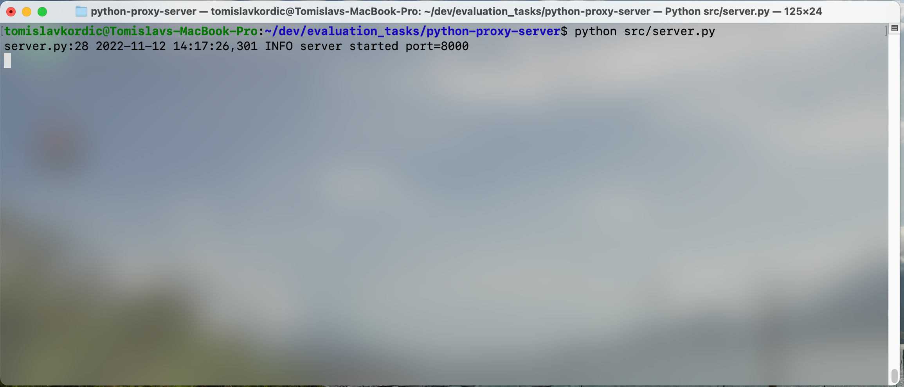

# proxy server

## Introduction
Simple proxy server for HTTP, HTTPS will not work. Run server_ip:port/status to see status page, number of requests processed and server start time.

## Run

* Bare Metal

  ```
  python3 src/server.py
  ```

* Makefile

  Build the image first, need to execute only once.
  ```
  make build
  ```
  Run the server
  ```
  make run
  ```

## Screenshot
<p align = "left">

</p>

## Setup and Testing
If running the proxy on your local machine with the above example, point your proxy to;
```localhost 8000```

Test access to a HTTP only webpage such as;
```http://neverssl.com```